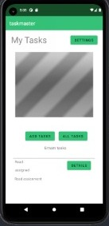

# taskmaster

## Day 1 

* added the outlays and configure its classes.
* added some styles.

## Day 2 

* added three tasks with separate details pages. 
* added a settings page that allows users to edit the name

## Day 3 

* We refactored our hard coded data into a recycled view loop

